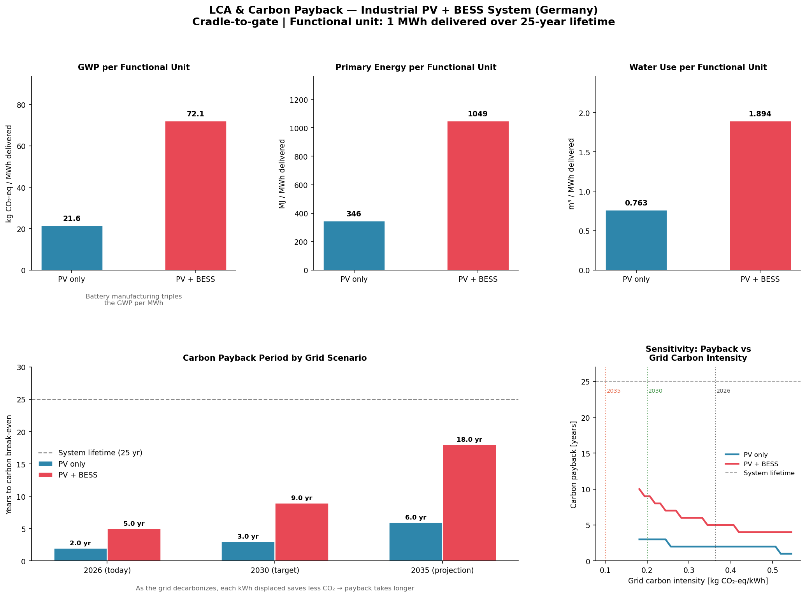

# LCA & Carbon Payback Analysis — Industrial PV + BESS System (Germany)

A Python-based Life Cycle Assessment (LCA) model comparing two configurations of an industrial rooftop solar system in Germany:

- **Configuration A** — 1 MWp PV system (standalone)
- **Configuration B** — 1 MWp PV + 2 MWh NMC battery storage (BESS)

**Central question:** Does adding a battery improve or worsen the environmental profile when manufacturing emissions are included?

---

## Methodology

Follows **ISO 14040:2006** and **ISO 14044:2006** — structured across the four LCA phases:

| Phase | Description |
|---|---|
| Goal & Scope | System boundary, functional unit, parameters |
| LCI | Manufacturing emission factors per component |
| LCIA | Normalization to functional unit (per MWh delivered) |
| Interpretation | Carbon payback period + sensitivity analysis |

**System boundary:** Cradle-to-gate (manufacturing + installation; end-of-life excluded)  
**Functional unit:** 1 MWh of electricity delivered over a 25-year system lifetime

---

## Results

### Environmental Impact per MWh Delivered

| Impact Category | PV only | PV + BESS |
|---|---|---|
| GWP [kg CO₂-eq/MWh] | 21.6 | 72.1 |
| Primary Energy [MJ/MWh] | 346 | 1,049 |
| Water Use [m³/MWh] | 0.763 | 1.894 |

Adding a battery increases manufacturing GWP by **3×** per MWh delivered.

### Carbon Payback Period

| Grid Scenario | PV only | PV + BESS |
|---|---|---|
| 2026 — 363 g CO₂/kWh (actual) | 2 years | 5 years |
| 2030 — 200 g CO₂/kWh (target) | 3 years | 9 years |
| 2035 — 100 g CO₂/kWh (projection) | 6 years | 18 years |

**Key insight:** As the German grid decarbonizes, each kWh of solar displaced saves less CO₂ — so carbon payback periods get longer over time. This is a counterintuitive but important finding for investment timing decisions.

### Output Charts



---

## Why BESS Is Still Justified

This model covers manufacturing impact only. BESS adoption is driven by additional factors not captured here:

- **Peak shaving** — reduces industrial demand charges
- **Self-consumption** — stores daytime solar for nighttime use
- **Grid balancing** — revenue from Germany's Regelenergiemarkt
- **Energy security** — hours of backup power independence

A complete business case weighs all of these alongside manufacturing impact.

---

## Project Structure

```
pv-bess-lca/
│
├── lca_model.py          # Main LCA model — all four ISO phases
└── outputs/
    └── lca_pv_bess_results.png   # Generated charts
```

## Data Sources

| # | Source |
|---|---|
| [1] | NREL LCA Harmonization Project — PV emission factors |
| [2] | Degen & Schutte (2021) — NMC battery LCA, Journal of Cleaner Production |
| [3] | ScienceDirect (2024) — Li-NMC LCA using openLCA + ecoinvent |
| [4] | Fraunhofer ISE Photovoltaics Report — solar yield Germany |
| [5] | Umweltbundesamt (UBA) 2024 — German grid: 363 g CO₂/kWh |
| [6] | BDEW / Wikipedia — Electricity sector Germany (2024) |
| [7] | EU REPowerEU / Klimaschutzprogramm — 2030 & 2035 grid targets |
| [8] | IRENA (2023) — NMC round-trip efficiency |
| [9] | ecoinvent 3.9 — BOS & water use factors |

---

## Author

**Kandarp Patel**  
Energy & Sustainability | Python | LCA | Energy System Modeling  
GitHub: [kandarppatel9630](https://github.com/kandarppatel9630)
